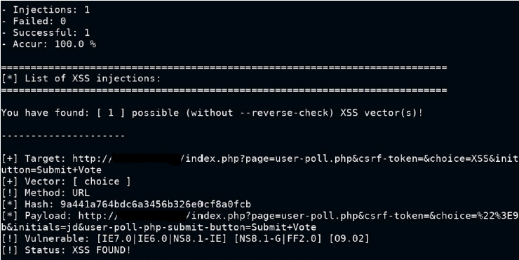
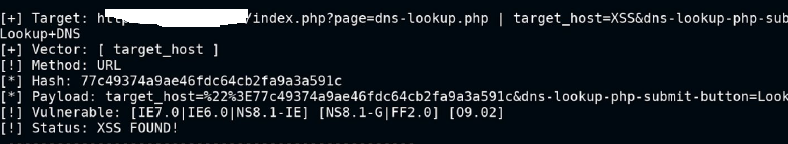

# WAPT-XSS-Cross-Site-Scripting-with-XSSer
Perform XSS attack with XSSer. I show only the important steps required to perform the attack, so i don't explain everything.
# Introduction of the tool
XSSer is a tool that can help you to perform cross site scripting attacks on web-based applications. Cross site scripting (XSS) is a type of attack that allows an attacker to inject malicious code into a web page that is viewed by other users, which can result in stealing cookies, session hijacking, phishing, or defacing websites. XSSer can do various tasks, such as: 
- Detecting XSS vulnerabilities in web applications using different techniques and vectors. 
- Exploiting XSS vulnerabilities by injecting code that can bypass filters, execute commands, or establish reverse connections. 
- Reporting XSS vulnerabilities by generating reports in different formats, such as HTML, XML, JSON, or CSV. 
XSSer is a command-line tool that can be used on any platform that supports Python. It has a powerful detection engine and a wide range of options and features that make it a versatile and effective tool for penetration testing and vulnerability assessment.
## XSS with XSSer
We perform the attack on OWASP Mutillidae II.  
### Goal: Get some payloads to perform XSS (POST).  
Use nmap to scan the network and identify the ports that are running the http and mysql services. The ports must be OPEN. 
1) Start Burp Proxy in interception mode and active FoxyProxy from browser to capture the http request. 
2) In the page vulnerable to XSS write something in the form and click search to intercept the request POST.
3) Replace the value of the parameter that reflects the value entered on the web page with XSS
4) Run the command:<b> xsser --url 'referer of the request' -p 'payload of the POST request with XSS value'</b>. 
   

You can also try use various XSS payloads in auto mode:<b> xsser --url 'referer of the request' -p 'payload of the POST request with XSS value' --auto</b> or use custom payload<b> xsser --url 'referer of the request' -p 'payload of the POST request with XSS value' --Fp ""</b> and open the final attack link to trigger the XSS vulnerability in the browser

### Goal: Get some payloads to perform XSS (GET).  
Use nmap to scan the network and identify the ports that are running the http and mysql services. The ports must be OPEN. 
1) In the page vulnerable to XSS select one option in the list and click submit vote to check the url.
2) Perform the scanning of payloads:<b> xsser --url “url with variable=XSS”</b>
   

You can use your custom script:<b> xsser --url “url with variable=XSS” --Fp ""</b> and open the final attack link to trigger the XSS vulnerability in the browser 
If u need a <b>XSS with auth</b> you can use:<b> xsser --url “url with variable=XSS” --cookie=”cookie” </b>  

#Author
<b>Xiao Li Savio Feng</b>
